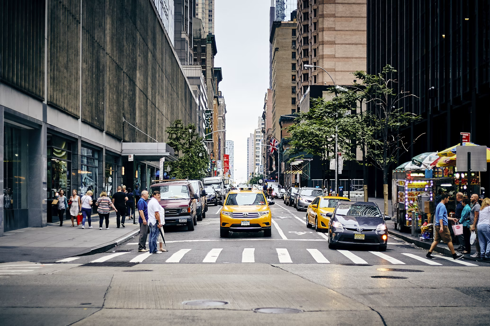

# Adaptive Edge AI Perception Engine for Autonomous Mobile Robots

> **Risk-aware adaptive multi-model perception for mobile robots, dynamically scheduling detection, segmentation, relative depth and pose according to scene risk and available edge compute.**

[](https://github.com/HARSHAVARDHAN-SEKAR/adaptive-edge-ai-perception/actions/workflows/ci.yml)


---

## Research Question

**Can an autonomous mobile robot dynamically select and adapt its AI perception models according to scene risk and available edge-compute resources instead of running the same expensive neural networks continuously?**

Traditional robot perception pipelines often execute a fixed detector or a fixed collection of neural networks at every frame.

This project explores a different approach:

- use inexpensive perception during low-risk patrol,
- increase perception capability when scene risk rises,
- activate detection, segmentation, relative depth and pose when required,
- degrade gracefully under compute pressure,
- preserve high-value perception for dangerous situations,
- publish fused scene understanding through ROS 2.

The objective is not simply to detect objects.

The objective is to create a **resource-aware perception manager for autonomous mobile robots**.

---

# System Architecture

```text
                         CAMERA / VIDEO
                               │
                               ▼
                    ┌─────────────────────┐
                    │   Input Pipeline    │
                    └──────────┬──────────┘
                               │
                               ▼
                 ┌──────────────────────────┐
                 │   Adaptive Scheduler     │
                 │                          │
                 │  Attention State         │
                 │  PATROL / ALERT /        │
                 │  ENGAGED                 │
                 │                          │
                 │  Resource State          │
                 │  NORMAL / CONSTRAINED /  │
                 │  CRITICAL                │
                 └────────────┬─────────────┘
                              │
                              ▼
                     MODEL EXECUTION PLAN
                              │
          ┌───────────────────┼────────────────────┐
          │                   │                    │
          ▼                   ▼                    ▼
    Object Detection      Segmentation       Relative Depth
          │                   │                    │
          └──────────────┬────┴──────────────┬─────┘
                         │                   │
                         ▼                   ▼
                  Pose Estimation       Optional VLM
                         │
                         └─────────┬─────────┘
                                   ▼
                         ┌──────────────────┐
                         │ Multi-Model      │
                         │ Fusion           │
                         └────────┬─────────┘
                                  │
                                  ▼
                         Scene Risk Engine
                                  │
                                  ▼
                         Decision Confidence
                                  │
                                  ▼
                    ┌────────────────────────┐
                    │ ROS 2 / Dashboard /    │
                    │ Logging / Telemetry    │
                    └────────────────────────┘
```

---

# Adaptive Perception Scheduler

The perception scheduler is built from two independent state machines.

## Attention State

The attention state represents how much perception capability the current scene requires.

```text
PATROL
  │
  │ increasing scene risk
  ▼
ALERT
  │
  │ high scene risk
  ▼
ENGAGED
```

Typical model plans are:

| Attention state | Typical perception plan |
|---|---|
| `PATROL` | lightweight object detection |
| `ALERT` | detection + relative depth |
| `ENGAGED` | larger detector + segmentation + relative depth + pose |

---

## Resource State

The resource state represents available edge-compute capacity.

```text
NORMAL
   │
   ▼
CONSTRAINED
   │
   ▼
CRITICAL
```

Signals can include:

- pipeline FPS,
- GPU utilization where available,
- inference latency,
- resource pressure.

Each state machine uses **hysteresis** to reduce rapid switching and scheduler oscillation.

The attention and resource states are then combined into the final model-execution plan.

A key design rule is:

> **Scene risk is evaluated before load shedding.**

A dangerous scene under compute pressure therefore still receives the best feasible perception plan instead of blindly disabling expensive models.

---

# Perception Backends

The project provides interfaces for several perception capabilities.

| Capability | Backend / representation |
|---|---|
| Object detection | YOLO-family detector |
| Larger object detector | higher-capacity YOLO-family detector |
| Segmentation | YOLO segmentation backend |
| Relative monocular depth | MiDaS |
| Human pose | YOLO pose |
| Scene narration | optional Ollama VLM |
| Multi-object understanding | perception fusion layer |
| Temporal association | class-aware IoU + centroid tracking |

The architecture separates the scheduler from the underlying model implementations so additional perception backends can be integrated later.

---

# Validation Status

The repository intentionally distinguishes between what is **CI tested**, what has been **functionally validated**, and what remains deployment work.

| Environment / capability | Validation status |
|---|---|
| Python 3.10 | CI tested |
| Python 3.11 | CI tested |
| Python 3.12 | CI tested |
| Core scheduler and pipeline tests | CI tested |
| Mock perception backend | CI tested |
| ROS 2 node logic with mocked `rclpy` | CI tested |
| ROS 2 Humble `colcon build` | CI tested in ROS Humble container |
| Lite Docker image | CI tested |
| Docker Compose configuration | CI tested |
| Dashboard API | CI smoke tested |
| Synthetic scheduler benchmark | reproducible |
| Real CUDA multi-model inference | functionally validated |
| Real urban street-scene inference | functionally validated |
| Gazebo `edge_bot` | launch + URDF provided |
| Jetson Orin TensorRT / INT8 | deployment scripts provided; hardware validation required |
| Metric depth | **not implemented** |
| Calibrated collision probability | **not implemented** |

---

# Real CUDA Street-Scene Validation

The repository includes a real-model functional test using an urban street image.

This experiment executes the actual perception backends rather than mock inference.

## Input



The test image contains:

- pedestrians,
- cars,
- a truck,
- multiple depth layers,
- partial occlusions,
- dense urban structure.

---

## Command

```bash
python3 -m benchmark.understanding_demo \
  --image assets/street_test.png \
  --backend real \
  --device cuda \
  --out assets/street_test_real_cuda.json
```

---

## Backend Status

| Module | Requested backend | Actual backend | Result |
|---|---|---|---|
| Nano object detector | real | real | PASS |
| Large object detector | real | real | PASS |
| Segmentation | real | real | PASS |
| MiDaS relative depth | real | real | PASS |
| Pose estimation | real | real | PASS |
| VLM scene narration | real | unavailable | optional / skipped |

The VLM component was unavailable because no compatible LLaVA/VILA model was running through Ollama.

Its absence does **not** trigger a silent mock fallback.

The remaining real perception stack continues normally.

---

## Detection-Only Output

The baseline detector produced:

**23 detections**

including:

- pedestrians,
- cars,
- one truck.

This represents the perception output before multi-model fusion.

---

## Multi-Model Fusion

After combining outputs from the available real perception models, the system produced:

**25 fused object hypotheses**

Each fused object can contain:

```text
object class
relative depth
human activity / pose information
approaching state
collision-risk heuristic
decision confidence
backend provenance
```

Example:

```text
person:
  rel_depth = 0.578
  activity = upright
  approaching = false
  risk = 34%
  confidence = 0.79
```

---

## Relative Depth

The real MiDaS backend produced fused relative-depth values approximately between:

```text
0.554 → 0.798
```

The representation is:

```text
0 = relatively near
1 = relatively far
```

**This is normalized monocular relative depth.**

It is **not metric range** and must not be interpreted as metres.

---

## Risk Output

The highest perception-level risk score in the validated street frame was:

```text
34%
```

This value is an internal heuristic used by the perception fusion and scheduling architecture.

It is **not a statistically calibrated collision probability**.

---

## Decision Confidence

The fused decision-confidence values for the validated frame ranged approximately from:

```text
0.46 → 0.79
```

These are internal decision-support scores.

They are not calibrated probabilities and have not been evaluated using ECE, NLL or Brier score.

---

## Evidence

The complete evidence for this test is committed to the repository:

```text
assets/street_test.png
assets/street_test_real_cuda.json

docs/street_scene_real_inference_report.md
docs/street_scene_real_inference_report.pdf
docs/make_street_scene_report.py
```

### Real-scene report

[View the real CUDA street-scene validation report](docs/street_scene_real_inference_report.pdf)

### Machine-readable output

[View the real CUDA inference JSON](assets/street_test_real_cuda.json)

The report is generated from the machine-readable JSON so the numerical results can be reproduced rather than manually copied into the report.

---

# Synthetic Scheduler Benchmark

The main scheduler benchmark uses deterministic synthetic scenes and latency-simulating mock perception models.

It evaluates:

> **scheduler behaviour and compute allocation**

It does **not** evaluate:

- YOLO mAP,
- segmentation IoU,
- Jetson performance,
- real GPU power,
- physical collision avoidance.

Run:

```bash
python3 -m benchmark.latency_test
```

Benchmark mission:

```text
120 frames
risk events around frames 30-41 and 80-91
```

---

## Results

| System | Mean FPS | Mean latency | Model-cost proxy | High-risk full-suite coverage |
|---|---:|---:|---:|---:|
| Fixed heavyweight | 6.7 | 148.7 ms | 1440 | 100% |
| Fixed lightweight | 89.8 | 11.0 ms | 120 | 0% |
| **Adaptive** | **33.0** | **92.5 ms** | **885** | **87%** |

The adaptive scheduler uses approximately:

**39% fewer model-cost proxy units**

than the fixed-heavy configuration while achieving approximately:

**4.9× its mean FPS**

and still executing the complete model suite on:

**87% of genuinely high-risk frames.**

---

## What Is a Model-Cost Proxy?

The benchmark assigns predefined relative model-cost values and sums the costs of the models that actually execute.

It is useful for comparing scheduler behaviour.

It is **not**:

- measured GPU energy,
- CPU utilization,
- TOPS,
- electrical power,
- actual Jetson power consumption.

---

# Demo Artifacts

### Synthetic adaptive mission

[Demo mission video](assets/demo_mission.mp4)

The video is explicitly watermarked:

```text
SYNTHETIC INPUT - MOCK MODEL LATENCIES
```

so synthetic benchmark evidence cannot be mistaken for real-robot perception.

---

### Synthetic benchmark report

[Generated research report](docs/report.pdf)

The benchmark report reads numerical values from committed experiment outputs.

---

### Real CUDA validation

[Street-scene validation report](docs/street_scene_real_inference_report.pdf)

[Real CUDA inference JSON](assets/street_test_real_cuda.json)

---

# ROS 2 Integration

The project includes a ROS 2 Humble package:

```text
ros2_ws/src/edge_perception_ros
```

The perception node exposes adaptive perception results to other robot components.

---

## ROS 2 Topics

| Topic | Type | Purpose |
|---|---|---|
| `/perception/objects` | `vision_msgs/Detection2DArray` | object detections |
| `/perception/scene` | `std_msgs/String` JSON | fused scene representation |
| `/perception/risk` | `std_msgs/Float32` | scene-level risk |
| `/perception/semantic_image_grid` | `std_msgs/String` JSON | semantic image-space grid |
| `/perception/status` | `std_msgs/String` JSON | scheduler / backend / FPS / latency status |

Important:

`/perception/semantic_image_grid` is an **image-space semantic grid**.

It is not:

- a metric occupancy grid,
- a bird's-eye-view costmap,
- a navigation map.

---

# ROS 2 Robot Simulation

The repository contains an example differential-drive robot:

```text
edge_bot
```

defined in:

```text
ros2_ws/src/edge_perception_ros/urdf/edge_bot.urdf.xacro
```

The robot includes a simulated camera publishing:

```text
/camera/image_raw
```

A dedicated launch file is provided:

```text
edge_bot_sim.launch.py
```

A TurtleBot3-compatible launch path is also included.

---

# Build ROS 2 in Docker

```bash
docker build \
  -f docker/Dockerfile.ros2 \
  -t edge-perception:ros2 .
```

Run:

```bash
docker run --rm -it edge-perception:ros2 bash
```

Inside the container:

```bash
ros2 run edge_perception_ros perception_node \
  --ros-args \
  -p backend:=mock
```

Monitor status:

```bash
ros2 topic echo /perception/status
```

---

# Native ROS 2 Humble Build

Install ROS dependencies:

```bash
sudo apt install \
  ros-humble-vision-msgs \
  ros-humble-cv-bridge \
  ros-humble-gazebo-ros-pkgs \
  ros-humble-xacro
```

Install the core Python package:

```bash
pip install -e .
```

Build:

```bash
cd ros2_ws

colcon build --symlink-install

source install/setup.bash
```

Launch:

```bash
ros2 launch edge_perception_ros edge_bot_sim.launch.py
```

Example velocity command:

```bash
ros2 topic pub \
  /cmd_vel \
  geometry_msgs/msg/Twist \
  "{linear: {x: 0.2}}" \
  -r 5
```

---

# Quick Start

## Clone

```bash
git clone \
  https://github.com/HARSHAVARDHAN-SEKAR/adaptive-edge-ai-perception.git

cd adaptive-edge-ai-perception
```

---

## Lightweight installation

```bash
pip install -e .
```

Run synthetic pipeline:

```bash
python3 run_pipeline.py \
  --source synthetic \
  --frames 300 \
  --backend mock
```

---

## Install real inference dependencies

```bash
pip install -e ".[real]"
```

For development:

```bash
pip install -e ".[real,dev]"
```

---

## Run Tests

```bash
python3 tests/test_pipeline.py
```

Expected:

```text
15 tests passed
```

Run ROS 2 logic simulation:

```bash
python3 tests/test_ros2_node_sim.py
```

---

# Docker

## Run tests

```bash
docker compose run test
```

---

## Start dashboard

```bash
docker compose up dashboard
```

Open:

```text
http://localhost:8090
```

---

## Run synthetic mission

```bash
docker compose run demo
```

---

## Run benchmark

```bash
docker compose run bench
```

---

## Full real-model Docker stage

```bash
docker compose up full
```

The full image installs the project real-model dependency group:

```text
.[real]
```

rather than maintaining a separate manually duplicated dependency list.

---

# Real Image Viewer

Example:

```bash
python3 viewer.py \
  --image assets/test_bus.jpg \
  --backend real \
  --record out.jpg
```

This runs real perception models on an image and writes a visualization.

---

# CUDA Real Inference

Example:

```bash
python3 -m benchmark.understanding_demo \
  --image assets/street_test.png \
  --backend real \
  --device cuda \
  --out assets/street_test_real_cuda.json
```

Backend provenance is recorded in the output.

For example:

```json
{
  "yolo_nano": {
    "requested": "real",
    "actual": "real"
  }
}
```

If a real backend cannot load, `backend=real` fails explicitly instead of silently replacing the model with mock inference.

---

# Backend Modes

The pipeline supports explicit backend behaviour.

## `mock`

```text
backend=mock
```

Used for:

- CI,
- deterministic scheduler tests,
- synthetic experiments.

---

## `real`

```text
backend=real
```

Requires the actual model backend.

If the backend cannot load, the request is reported as unavailable/failing rather than silently substituted.

---

## `auto`

```text
backend=auto
```

May fall back when required, but the fallback is visible and backend provenance is recorded.

This distinction prevents mock output from being accidentally presented as real-model evidence.

---

# Multi-Model Fusion

The fusion layer combines available perception outputs into a unified scene representation.

Potential information includes:

```text
object class
detection confidence
relative depth
pose/activity
approach state
risk estimate
decision confidence
backend provenance
```

Example output:

```json
{
  "object": "person",
  "rel_depth": 0.578,
  "depth_scale": "relative",
  "activity": "upright",
  "approaching": false,
  "collision_risk_pct": 34,
  "decision_confidence": 0.79
}
```

---

# Tracking

The current tracker uses:

- class-aware association,
- IoU matching,
- centroid gating.

This is intentionally lightweight.

Potential future replacements include:

- ByteTrack,
- SORT / DeepSORT,
- Kalman filtering,
- learned re-identification.

---

# Relative Depth

MiDaS is used for monocular **relative depth**.

Output semantics:

```text
0 → relatively near
1 → relatively far
```

The project deliberately uses:

```text
rel_depth
```

rather than pretending monocular relative-depth values are metres.

For metric range estimation, future versions could integrate:

- RGB-D cameras,
- stereo cameras,
- LiDAR,
- calibrated depth models,
- sensor fusion.

---

# Risk Estimation

The fusion layer computes a perception-level risk score using available scene information.

Inputs can include:

- detected class,
- relative depth,
- motion / approach state,
- pose/activity information,
- perception confidence.

The risk value is intended to guide the adaptive scheduler.

It is **not** a certified safety probability.

---

# Resource-Aware Scheduling

The scheduler can respond to:

- reduced FPS,
- increased model latency,
- elevated GPU load,
- resource constraints.

Rather than disabling models arbitrarily, it chooses the most useful feasible perception configuration according to both:

```text
scene importance
+
compute availability
```

This makes the project relevant to edge robotics platforms where compute and power are limited.

---

# Jetson Deployment Path

A Jetson deployment Dockerfile is provided:

```text
docker/Dockerfile.jetson
```

Jetson-specific dependencies are maintained in:

```text
requirements-jetson.txt
```

The current Jetson container path targets an Orin-generation L4T / JetPack environment.

Potential deployment technologies include:

- NVIDIA CUDA,
- TensorRT,
- FP16,
- INT8,
- PyCUDA,
- Jetson statistics / telemetry.

## Important

JetPack already supplies tightly coupled CUDA, TensorRT and OpenCV components.

The Jetson deployment path therefore should not be treated like a generic desktop pip environment.

The supplied deployment path still requires validation on the target physical Jetson hardware.

---

# TensorRT / INT8

Optimization utilities are included for later deployment experiments.

These scripts are intended to support:

```text
PyTorch / ONNX
        ↓
TensorRT
        ↓
FP16 / INT8
        ↓
Jetson edge deployment
```

A real Jetson benchmark should measure:

- end-to-end latency,
- FPS,
- GPU utilization,
- memory,
- power,
- thermals.

Those measurements are not claimed by the current synthetic scheduler benchmark.

---

# Dashboard

The repository includes a lightweight telemetry dashboard.

It can display information such as:

- scheduler mode,
- attention state,
- resource state,
- active models,
- backend provenance,
- scene risk,
- FPS,
- latency.

Run:

```bash
docker compose up dashboard
```

Then open:

```text
http://localhost:8090
```

The current dashboard has no authentication and should not be exposed directly to an untrusted network.

---

# Continuous Integration

GitHub Actions validates:

```text
Python 3.10
Python 3.11
Python 3.12
        │
        ├── package installation
        ├── Ruff
        ├── unit tests
        ├── scheduler tests
        ├── backend tests
        ├── ROS2 logic simulation
        ├── CLI smoke test
        ├── benchmark smoke test
        ├── dashboard API test
        └── report generation
```

Additional jobs validate:

```text
Docker
 ├── lite image build
 ├── container tests
 └── compose configuration

ROS 2 Humble
 ├── package dependencies
 ├── colcon build
 ├── node imports
 └── URDF/Xacro parsing
```

---

# Repository Structure

```text
adaptive-edge-ai-perception/
│
├── edge_perception/
│   ├── models/
│   ├── scheduler/
│   ├── fusion/
│   ├── optimizer/
│   └── pipeline.py
│
├── benchmark/
│   ├── latency_test.py
│   ├── format_test.py
│   ├── accuracy_test.py
│   └── understanding_demo.py
│
├── ros2_ws/
│   └── src/
│       └── edge_perception_ros/
│           ├── perception_node.py
│           ├── launch/
│           └── urdf/
│
├── dashboard/
│
├── docker/
│   ├── Dockerfile
│   ├── Dockerfile.ros2
│   ├── Dockerfile.jetson
│   └── entrypoint.sh
│
├── assets/
│   ├── demo_mission.mp4
│   ├── understanding_demo.json
│   ├── street_test.png
│   └── street_test_real_cuda.json
│
├── docs/
│   ├── report.md
│   ├── report.pdf
│   ├── street_scene_real_inference_report.md
│   ├── street_scene_real_inference_report.pdf
│   ├── make_report_pdf.py
│   └── make_street_scene_report.py
│
├── tests/
│   ├── test_pipeline.py
│   └── test_ros2_node_sim.py
│
├── viewer.py
├── run_pipeline.py
├── requirements-jetson.txt
├── pyproject.toml
├── docker-compose.yml
├── ATTRIBUTIONS.md
├── LICENSE
└── README.md
```

---

# Reproducibility

The repository separates three forms of evidence.

## 1. Deterministic scheduler testing

Uses:

```text
synthetic scenes
+
mock model latency
```

Purpose:

```text
scheduler correctness
resource allocation
state-machine behaviour
```

---

## 2. Real-model functional validation

Uses:

```text
real neural-network backends
+
CUDA
+
real image
```

Purpose:

```text
verify the real inference path
verify fusion
verify backend provenance
verify relative-depth handling
```

---

## 3. Future hardware benchmarking

Requires physical deployment on systems such as:

```text
Jetson Orin
mobile robot
camera hardware
```

Purpose:

```text
true latency
power
thermal
GPU
memory
real-time behaviour
```

These evidence categories are intentionally not mixed.

---

# Limitations

This repository is a **research and engineering prototype**, not a certified autonomous-driving or robot-safety system.

Current limitations include:

- **Depth is relative, not metric.**
  MiDaS values are normalized monocular depth cues.

- **Decision confidence is heuristic.**
  It is not calibrated uncertainty.

- **Collision risk is heuristic.**
  It is not a certified collision probability.

- **Synthetic scheduler benchmarks do not measure model accuracy.**

- **Model-cost proxy is not power consumption.**

- **The real street-scene experiment uses one image.**
  It demonstrates functional execution, not statistical accuracy.

- **Tier accuracy / agreement metrics do not replace labelled-dataset mAP evaluation.**

- **Tracking is currently lightweight.**

- **The VLM backend is optional.**

- **Jetson deployment has not yet been validated on every Jetson family.**

- **Gazebo runtime validation should be expanded.**

- **The dashboard currently has no authentication.**

---

# Future Work

Potential extensions include:

### Perception

- calibrated uncertainty estimation,
- RGB-D / LiDAR metric depth,
- SAM-style segmentation,
- stronger tracking,
- DINO-based open-vocabulary perception,
- vision-language scene reasoning.

### Adaptive scheduling

- reinforcement-learning model scheduler,
- learned compute policies,
- deadline-aware perception,
- task-conditioned perception,
- predictive resource allocation.

### Robotics integration

- Nav2 integration,
- semantic costmaps,
- dynamic obstacle reasoning,
- behaviour-planner interface,
- safety-supervisor integration.

### Edge deployment

- Jetson Orin hardware benchmark,
- TensorRT FP16,
- TensorRT INT8,
- power profiling,
- thermal profiling,
- memory profiling.

### Evaluation

- COCO-style object-detection metrics,
- segmentation IoU,
- pose metrics,
- depth-ranking accuracy,
- calibrated risk evaluation,
- multi-environment robot experiments.

---

# Why This Project Matters

Autonomous robots do not always need maximum perception complexity.

A robot moving through an empty corridor may only need a lightweight detector.

When:

```text
a person enters the path,
an obstacle appears,
scene uncertainty rises,
or navigation risk increases,
```

the robot should be able to allocate additional perception compute automatically.

This project explores that transition from:

```text
fixed perception
```

to:

```text
adaptive robot perception
```

where perception capability becomes a dynamically managed resource.

---

# Portfolio Focus

This project demonstrates experience with:

- autonomous mobile robot perception,
- adaptive AI systems,
- model scheduling,
- deep-learning inference,
- multi-model perception fusion,
- relative monocular depth,
- human pose estimation,
- resource-aware robotics,
- CUDA inference,
- ROS 2,
- Docker,
- Gazebo integration,
- Jetson deployment architecture,
- CI/CD,
- reproducible robotics experimentation.

---

# License

This repository is licensed under:

**AGPL-3.0**

See:

[LICENSE](LICENSE)

Ultralytics-based components are subject to their applicable licensing terms.

For closed-source commercial deployments, review the relevant Ultralytics licensing requirements separately.

---

# Attribution

Third-party components and model dependencies are documented in:

[ATTRIBUTIONS.md](ATTRIBUTIONS.md)

---

# Author

**Harshavardhan Coimbatore Sekar**

Autonomous Mobile Robots · ROS 2 · Robot Perception · Navigation · Edge AI

GitHub:

**HARSHAVARDHAN-SEKAR**

---

## Project Status

**Research prototype — actively developed and validated through CI, synthetic scheduler experiments and real CUDA inference tests.**

The current repository demonstrates the architecture and software pipeline while clearly separating validated functionality from future robot-hardware and Jetson performance claims.
